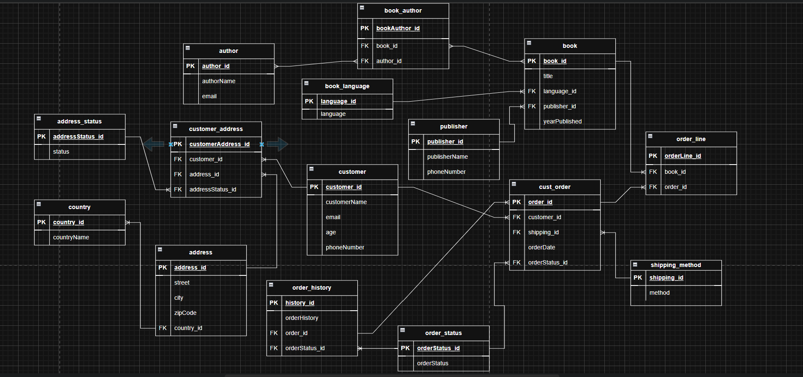

# Database Group of 3 Assignment
## Contributors of this groupwork are :
|Name|Email|GitHub Link|
| ------- | ------- | ------- |
|Peter Kuol Amol|kuolamol77@gmail.com|[Peter Kuol](https://github.com/Quol04)| 
|Justus Odiwuor|justusodiwuor2019@gmail.com|[Justus](https://github.com/justusodi)|
|Elizabeth Wamalwa|elizwamalwa@gmail.com|[Elizabeth](https://github.com/elizwamalwa)|

---
## Tools and Technologies

**MySQL** -For building and managing the database

**Draw.io** -For visualizing the database schema and relationships

---
## Step-by-Step Instructions
- Create a new database to store bookstore data.
- Determine the table schema and data types
- Write the SQL commands to create tables that match the data structure
- Set up user groups and roles to control access to the database
- Test the database by running queries to retrieve and analyze the data

---
## Tables to Be Created
#### Here are the key tables that you'll design and implement for the bookstore database:
**book**: A list of all books available in the store.

**book_author**: A table to manage the many-to-many relationship between books and authors.

**author**: A list of all authors.

**book_language**: A list of the possible languages of books.

**publisher**: A list of publishers for books.

**Customer**: A list of the bookstore's customers.

**customer_address**: A list of addresses for customers. Each customer can have multiple addresses.

**address_status**: A list of statuses for an address (e.g., current, old).

**address**: A list of all addresses in the system.

**country**: A list of countries where the addresses are located.

**cust_order**: A list of orders placed by customers.

**order_line**: A list of books that are part of each order.

**shipping_method**: A list of possible shipping methods for an order.

**order_history**: A record of the history of an order (e.g., ordered, cancelled, delivered).

**order_status**: A list of possible statuses for an order (e.g., pending, shipped, delivered). 

---
## ER Diagram

